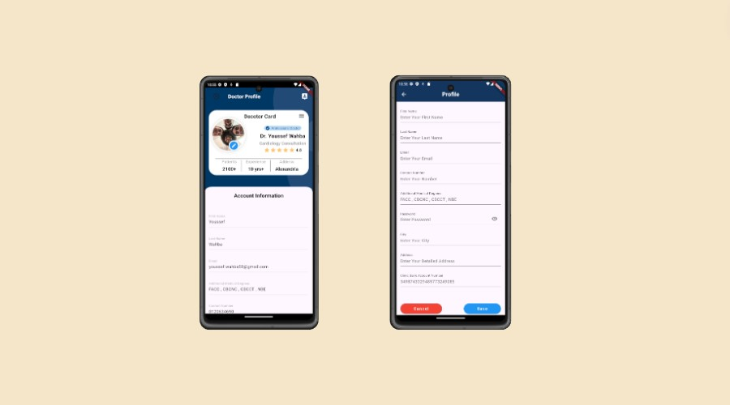

<!-- # Cura-healthcare-mobile-application- -->

# <center >Cura</center>

## What does it do?

Cura is a healthcare mobile application. It consists of 2 applications, the doctor app and the patient app. The doctor's app help him managing his appointements, by creating and canceling the timeslots, and accessing and updating the desired patient's EMR (Electronic Medical Record). In the other hand, the Patient's app help him book appointements at the desired doctor with suitable date and time and he also can access and update his EMR.

## Technologies used

[](https://skillicons.dev)

## Getting Started

### Prerequisites

- [Cura backend server (server repository)](https://github.com/MoustafaAshraf8/Cura_backend_server)
- [dart](https://dart.dev/)
- [flutter](https://flutter.dev/)

### Demo

#### Patient App

- 
- 
- 
- 
- 
- 
- 
- 
- 

#### Doctor App

- 
- 
- 
- 
- 

### Installation

#### Below are the steps to help you install and run the project:

1. Clone the repository

```
git clone https://github.com/MoustafaAshraf8/Cura-healthcare-mobile-application-.git
```

### Usage

#### Below are the steps to run the Patient app

1. Navigate to Patient app

```
cd graduation_project
```

2. Download dependencies

```
flutter pub get
```

3. Run the app

```
flutter run lib/main.dart
```

#### Below are the steps to run the Doctor app

1. Navigate to Doctor app

```
cd cura_for_doctor
```

2. Download dependencies

```
flutter pub get
```

3. Run the app

```
flutter run lib/main.dart
```
